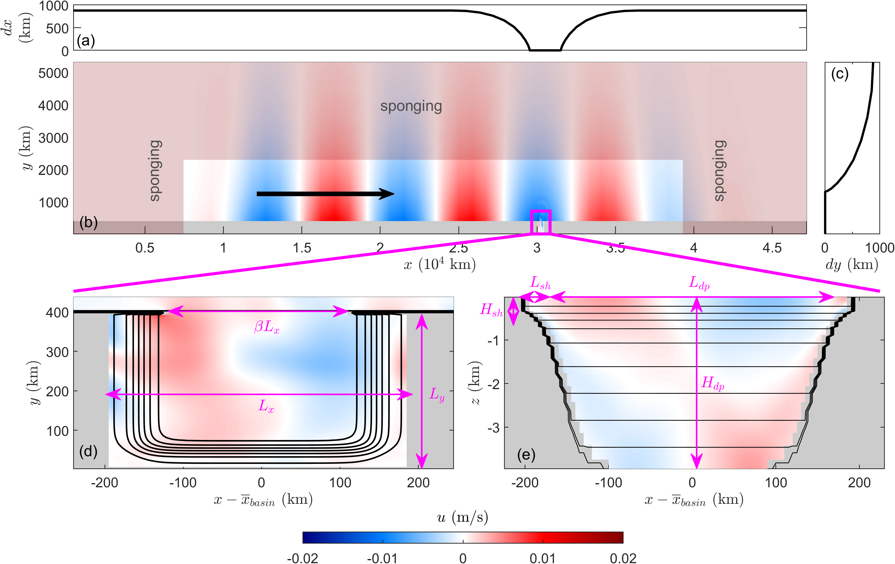

# basin_modes
Data and code repository to support manuscript titled "Internal tides generation in semi-enclosed ocean basins"

### Model set-up

 

 - Most of the domain has uniform depth of $H_0$, with a vertical wall representing the coast at $y=L_y$ km.
 - Around $x=3\times 10^{4}$ km, there is a semi-enclosed basin with horizontal dimensions of $L_x$ and $L_y$ (magenta box in setup figure (b) expanded in setup figure (d)).
 - Basin has an inlet of width $\beta L_x$.

 - Basin bottom topography is of the following form:

$$h(x,y) = \left(-h_s-\frac{H-h_s}{2}\left[1 + \mbox{tanh}\left(\frac{x-x_1-l}{dh} \right)  \right]\right)h^y(y) \qquad x_1\leq x<\frac{x_2-x_1}{2}; $$

$$h(x,y) = \left(-h_s-\frac{H-h_s}{2}\left[1 - \mbox{tanh}\left(\frac{x-L_x-x_1-l}{dh} \right)  \right]\right)h^y(y) \qquad \frac{x_2-x_1}{2}\leq x \leq x_2$$

where

$$h^y(y) = -h_s-\frac{H-h_s}{2}\left[1 + \mbox{tanh}\left(\frac{y-l}{dh} \right)  \right]\qquad \qquad y\leq L_y $$
    
and $H$ is the maximum basin depth, $h_s$ is the shelf depth, $l$ is the shelf width, and $x_1$ and $x_2$ are the extents of the the semi-enclosed basin within the overall simulation domain. 
For most of the simulations, we set $H=H_0=4$ km. We set $h=250$ m, $l=50$ km, and $dh=25$ km for all simulations.

   - The basin domain is vertically stratified, and we take density to be only a function of potential temperature $\theta$, such that 

$$\theta(z) = \frac{1}{\alpha_\theta}\left(1-\frac{\rho(z)}{\rho_0} \right)+5, $$

where

$$\rho(z) = \rho_2 - \frac{\rho_2 - \rho_1}{2}\left[1 + \mbox{tanh}\left(\frac{z-Z_{pyc}}{\mu_{pyc}} \right)  \right] - \frac{N^2_{bg}\rho_0}{g}z$$

and $\alpha_\theta=2\times 10^{-4}\,\rm{K^{-1}}$ is the thermal expansion coefficient, $\rho_0 = (\rho_1+\rho_2)/2$ for $\rho_1=992\, \rm{kg\, m^{-3}}$ and $\rho_1=995\, \rm{kg\, m^{-3}}$, $N^2_{bg}=1.22\times 10^{-5}\,\rm{s^{-2}}$ is the background buoyancy frequency squared, and $Z_{pyc}=400$ m and $\mu_{pyc}=400$ m are the thermocline depth and width, respectively.

  - Forcing: barotropic Kelvin wave with forcing frequency $\omega$, which is varied, propagating from the left of the domain to the right as marked by black arrow in setup figure (b)

### "data" folder 
 Sample data generated for a test case simulation with basin horizontal dimensions $L_x=L_y=400$ km and Kelvin wave forcing frequency of $\omega=1.48\times 10^{-4}$ rad/s. 
 
### "MITgcm_code" folder
 - Underlying MITgcm code to set up a suite of simulations for a certain basin size (here basin horizontal dimensions $L_x=L_y=400$ km) to sweep over Kelvin wave forcing frequencies $\omega \in [1.05\times 10^{-4},3\times 10^{-4}]$ rad/s (60 simulations)
 - "setup" folder contains files to be modified for each simulation setup (see Readme in the folder for details)
 - "build" and "runs" folder contents are generated after running file(s) in the "setup" folder
 - "code" and "input" folders contain MITgcm code files (both templates and files generated after running file(s) in the "setup" folder)
 - "exec" folder is empty - will be populated with executables when the code is compiled
 
### "python_post_processing" folder 
 Examples of how to plot output data (from "data" folder) in Python; here, using Jupyter notebook
